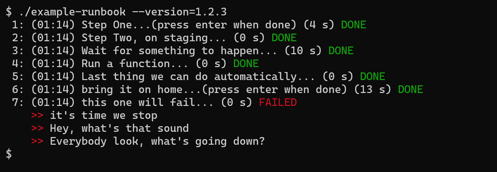

# Runbook-framework

"Any sufficiently detailed documentation is executable"
-- me

## What is it?

A shell (bash) framework to implement runbook scripts that help move from fully manual to fully
automated processes.

Based on the clever concept of
a [Do Nothing Script](https://blog.danslimmon.com/2019/07/15/do-nothing-scripting-the-key-to-gradual-automation/),
provide some structure for the script which allows & encourages documentation and useful tracking at run time.

You write this code:
```shell
runbook() {
  step "Step One"
  step "Step Two, on $env" echo "set $env=$version"
  step "Wait for something to happen" sleep 10
  step "Run a function" run-function
  step "Last thing we can do automatically" echo "Version is $version"
  step "bring it on home"
  step "this one will fail" fail_me
}
```

And you can run it and get



Or if you just need to produce some documentation, you can get
```text
$ ./example-runbook --version=1.2.3 -doc
1: Step One
2: Step Two, on staging
3: Wait for something to happen
4: Run a function
5: Last thing we can do automatically
6: bring it on home
7: this one will fail
$
```


## Background

I love automation, but often getting something "automated" is a long process, and you actually need
to get something done now and don't have the time to fully automate it.

A few years ago I read
a [blog post](https://blog.danslimmon.com/2019/07/15/do-nothing-scripting-the-key-to-gradual-automation/)
presenting a clever way to move from unautomated to automated processes.

The clever key:  start with a script that does nothing other than tell you what to do. A checklist.
Then, as time evolves, you can automate one little piece. Since the script is walking you through a
checklist, this becomes one step that's done for you instead of you having to do it. This is one of
those simple and amazingly insightful ways of getting things done.

This repository implements a small library of BASH functions to support runbooks in a consistent and
useful way.

## Quickstart

Be sure to read the ["important details"](#important-details) section.

### Writing the script

Create a script that looks like this:

```shell
#!/bin/bash

source runbook-framework.sh

parameters p1 p2
p1="some default value"

# Here's where you put your actual runbook steps
runbook() {
  step "This is a manual step and you'll get a prompt"
  step "This is an automated step" some-command
}

# This must be the last line in your file
main "$@"
```

Of course, the steps should be doing whatever it is you need.  `some-command` can be a function you
define (I suggest later in the file, so the file starts with your runbook).

If you leave out the command, you've just made a prompt. If you include the command, it will be
executed. The status of all commands will be printed as they are executed.

### Running the script

The framework provides some overall features, including

* -help|-h -- show how to run this runbook, including the parameters
* -doc -- show the checklist *without* executing it
* -verbose|-v -- show the output of each command as it happens

### What happened to the output?

The output of each step is stored away and shown only on error or on request.

### Important Details

The script sets up bash to be pretty paranoid, specifically:

```shell
set -ueo pipefail
```

The short form is:  unexpanded variables will be an error, any error (that's not in a conditional)
will stop the script, and it counts errors in the middle of a pipeline, not just the result of the
last command in the pipeline.

## Passing Parameters

You can set the `parameters` variable to a list of parameters you want to use in your script. They
will be set as (global) environment variables, exactly as you type them. All names that begin with
an underscore ('_') are reserved.

When you call the script, you may pass these variables on the command line as command line options.
If any of them are unset, the script will stop. So, if you want a default value, make sure you set
it.

## Examples

### Just try to run it

```shell
$ ./example-runbook
Parameter 'version' required
Usage: ./example-runbook [-h|-help] [-show] [--env=VALUE] --version=VALUE 
Defaults:
   env = staging
```

### Get some documentation on the process

```shell
$ ./example-runbook  --version=1.2.3 -doc
1: Step One
2: Step Two, on staging
3: Wait for something to happen
4: Run a function
5: Last thing we can do automatically
6: bring it on home
7: this one will fail
```

### Actually run the runbook

```shell
$ ./example-runbook  --version=1.2.3
 1: (00:52) Step One...(press enter when done) (5 s) DONE
 2: (00:52) Step Two, on staging... (0 s) DONE
 3: (00:52) Wait for something to happen... (10 s) DONE
 4: (00:52) Run a function... (0 s) DONE
 5: (00:52) Last thing we can do automatically... (0 s) DONE
 6: (00:52) bring it on home...(press enter when done) (12 s) DONE
 7: (00:53) this one will fail... (0 s) FAILED
    >> it's time we stop
    >> Hey, what's that sound
    >> Everybody look, what's going down?
```

## The Future

* the -doc argument should extract some documentation from the comment blocks and include it.
* can we do some kind of time estimate and make that useful information? ([discussion here](https://github.com/deweysasser/runbook-framework/discussions/9))

### Documentation

I'd like to make a "generate a fairly complete markdown document describing the process" be a feature.  The question is how to do that without obscuring the actual logic.  See [the github discussion](https://github.com/deweysasser/runbook-framework/discussions/6)

### Managing state

Would it be interesting to manage the current state of "a run"  in a persistent way, particularly so it could be resumed later if e.g. a step failed or something? ([discussion here](https://github.com/deweysasser/runbook-framework/discussions/10))